# Intro

Caching is a technique that enables the reuse of previously downloaded content. It provides a significant performance benefit by avoiding costly network requests and it also helps scale an application by reducing the traffic to a website’s origin infrastructure. There’s an old saying, “ the fastest request is the one that you don't have to make”, and caching is one way to avoid having to make requests.

There are three guiding principles to caching web content:

**Cache as much as you can**

When considering how much can be cached, it’s important to understand whether a response is static or dynamic.  Requests that are served a static response are typically cacheable, as they have a one-to-many relationship between the resource and the users requesting it. Dynamically generated content, can be more nuanced and require careful consideration.

**Cache for as long as you can**

The length of time you would cache a resource is highly dependent on the sensitivity of the content being cached. A versioned JavaScript resource could be cached for a very long time, while a non-versioned resource may need a shorter cache duration to ensure users get a fresh version.

**Cache as close to end users as you can**

Caching content close to the end user reduces download times by removing latency. For example, if a resource is cached on an end user’s browser, then the request never goes out to the network and the download time is as fast as the machine’s I/O.  For first time visitors or visitors that don't have entries in their cache, a CDN would typically be the next place a cached resource is returned from.  In most cases, it will be faster to fetch a resource from a local cache or a CDN compared to an origin server.

Web architectures typically involve [multiple tiers of caching](https://blog.yoav.ws/tale-of-four-caches/). For example, an HTTP request may have the opportunity to be cached in:


*   an end user's browser
*   A Service worker cache in the user’s browser
*   A shared gateway 
*   CDNs - which offer the ability to cache at the edge, close to end users.
*   A caching proxy in front of the application (to reduce the backend workload)
*   The application and database layers.

This chapter will explore how resources are cached within web browsers.


# Overview of HTTP Caching

For an HTTP client to cache a resource, it needs to understand two pieces of information:

*   “How long am I allowed to cache this for?”
*   “How do I validate that the content is still fresh?”

When a web browser sends a response to a client, it typically includes headers that indicate whether the resource is cacheable, how long to cache it for, and how old the resource is. RFC 7234 covers this in more detail in section[ 4.2 (Freshness)](https://tools.ietf.org/html/rfc7234#section-4.2) and[ 4.3 (Validation)](https://tools.ietf.org/html/rfc7234#section-4.3).

The HTTP response headers typically used for **conveying** freshness lifetime are :

*   Cache-Control (directives allow you to configure a cache lifetime duration)
*   Expires (provides an expiration, Cache-Control takes priority if both are present)

The HTTP response headers for **validating** the responses stored within the cache, i.e. giving conditional requests something to compare to on the server side, are:

*   Last-Modified (indicates when the object was last modified)
*   Etag (provides a unique identifier for the content)

The example below contains an excerpt of a request/response header from HTTP Archive’s main.js file. These headers indicate that the resource can be cached for 43200 seconds (12 hours), and it was last modified more than 2 months ago (difference between the last-modified and date headers).


```
> GET /static/js/main.js HTTP/2
> Host: httparchive.org
> User-Agent: curl/7.54.0
> Accept: */*
>

< HTTP/2 200
< date: Sun, 13 Oct 2019 19:36:57 GMT
< content-type: application/javascript; charset=utf-8
< content-length: 3052
< vary: Accept-Encoding
< server: gunicorn/19.7.1
< last-modified: Sun, 25 Aug 2019 16:00:30 GMT
< cache-control: public, max-age=43200
< expires: Mon, 14 Oct 2019 07:36:57 GMT
< etag: "1566748830.0-3052-3932359948"
```

The tool [RedBot.org](https://redbot.org/) allows you to input a URL and see a detailed explanation of how the response would be cached based on these headers. For example, [a test for the URL above](https://redbot.org/?uri=https%3A%2F%2Fhttparchive.org%2Fstatic%2Fjs%2Fmain.js) would output the following: 


If no caching headers are present in a response, then the [client is permitted to heuristically cache the response](https://paulcalvano.com/index.php/2018/03/14/http-heuristic-caching-missing-cache-control-and-expires-headers-explained/). Most clients implement a variation of the RFC’s suggested heuristic - which is 10% of the time since last modified. However some may cache the response indefinitely. So it is important to set specific caching rules to ensure that you are in control of the cacheability. 

According to the HTTP Archive, in July 2019 72% of responses were served with a Cache-Control header, and 56% of responses were served with an Expires header. However 27% of responses did not use either header, and are subject to heuristic caching! This was consistent across both desktop and mobile sites.

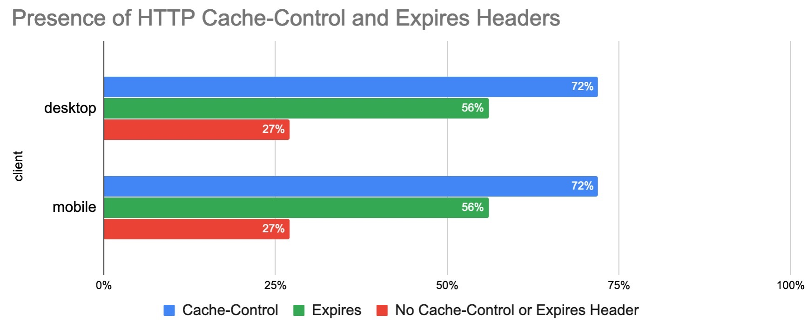

# What Type of Content Are We Caching

A cacheable resource is stored by the client for a period of time and available for reuse on a subsequent request. Across all HTTP requests, 80% of responses are considered cacheable, meaning that a cache is permitted to store them. Out of these, 

*   6% of requests have a TTL of 0 seconds, which immediately invalidates a cached entry.
*   27% are cached heuristically because of a missing Cache-Control header.
*   47% are cached for at least 1 second.

The remaining responses are not permitted to be stored in browser caches.

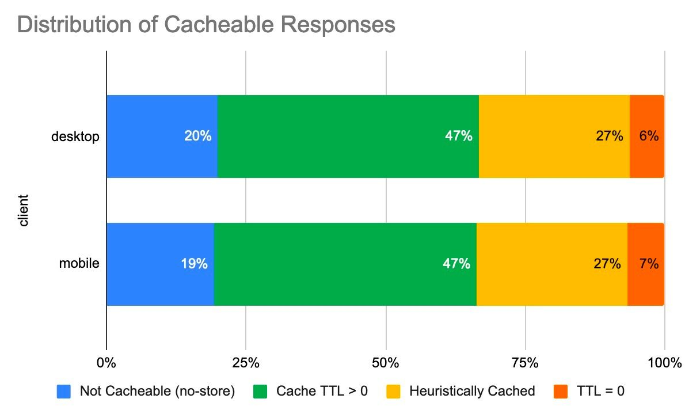

The table below details the cache TTL values for desktop requests by type. Most content types are being cached, however CSS resources appear to be consistently cached at high TTLs.

While most of the median TTLs are high, the lower percentiles highlight some of the missed caching opportunities. For example, the median TTL for images is 28 hours, however the 25th percentile is just 1-2 hours and the 10th percentile indicates that 10% of cacheable image content is cached for less than 1 hour.


<table>
  <tr>
   <td></td>
   <td colspan="5" >Desktop Cache TTL Percentiles (Hours)</td>
  </tr>
  <tr>
   <td><em>type</em></td>
   <td>p10</td>
   <td>p25</td>
   <td>p50</td>
   <td>p75</td>
   <td>p90</td>
  </tr>
  <tr>
   <td>audio</td>
   <td><p style="text-align: right">12</p></td>
   <td><p style="text-align: right">24</p></td>
   <td><p style="text-align: right">720</p></td>
   <td><p style="text-align: right">8760</p></td>
   <td><p style="text-align: right">8760</p></td>
  </tr>
  <tr>
   <td>css</td>
   <td><p style="text-align: right">720</p></td>
   <td><p style="text-align: right">8760</p></td>
   <td><p style="text-align: right">8760</p></td>
   <td><p style="text-align: right">8760</p></td>
   <td><p style="text-align: right">8760</p></td>
  </tr>
  <tr>
   <td>font</td>
   <td><p style="text-align: right">< 1</p></td>
   <td><p style="text-align: right">3</p></td>
   <td><p style="text-align: right">336</p></td>
   <td><p style="text-align: right">8760</p></td>
   <td><p style="text-align: right">87600</p></td>
  </tr>
  <tr>
   <td>html</td>
   <td><p style="text-align: right">< 1</p></td>
   <td><p style="text-align: right">168</p></td>
   <td><p style="text-align: right">720</p></td>
   <td><p style="text-align: right">8760</p></td>
   <td><p style="text-align: right">8766</p></td>
  </tr>
  <tr>
   <td>image</td>
   <td><p style="text-align: right">< 1</p></td>
   <td><p style="text-align: right">1</p></td>
   <td><p style="text-align: right">28</p></td>
   <td><p style="text-align: right">48</p></td>
   <td><p style="text-align: right">8760</p></td>
  </tr>
  <tr>
   <td>other</td>
   <td><p style="text-align: right">< 1</p></td>
   <td><p style="text-align: right">2</p></td>
   <td><p style="text-align: right">336</p></td>
   <td><p style="text-align: right">8760</p></td>
   <td><p style="text-align: right">8760</p></td>
  </tr>
  <tr>
   <td>script</td>
   <td><p style="text-align: right">< 1</p></td>
   <td><p style="text-align: right">< 1</p></td>
   <td><p style="text-align: right">1</p></td>
   <td><p style="text-align: right">6</p></td>
   <td><p style="text-align: right">720</p></td>
  </tr>
  <tr>
   <td>text</td>
   <td><p style="text-align: right">21</p></td>
   <td><p style="text-align: right">336</p></td>
   <td><p style="text-align: right">7902</p></td>
   <td><p style="text-align: right">8357</p></td>
   <td><p style="text-align: right">8740</p></td>
  </tr>
  <tr>
   <td>video</td>
   <td><p style="text-align: right">< 1</p></td>
   <td><p style="text-align: right">4</p></td>
   <td><p style="text-align: right">24</p></td>
   <td><p style="text-align: right">24</p></td>
   <td><p style="text-align: right">336</p></td>
  </tr>
  <tr>
   <td>xml</td>
   <td><p style="text-align: right">< 1</p></td>
   <td><p style="text-align: right">< 1</p></td>
   <td><p style="text-align: right">< 1</p></td>
   <td><p style="text-align: right">< 1</p></td>
   <td><p style="text-align: right">< 1</p></td>
  </tr>
</table>


By exploring the cacheability by content type in more detail, we can see that approximately half of all HTML responses are considered non-cacheable. Additionally, 16% of images and scripts are non-cacheable. 

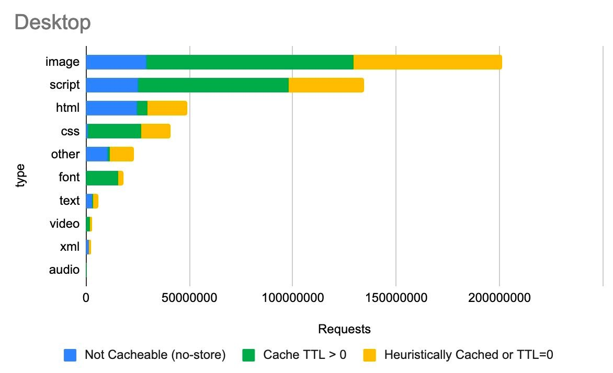

The same data for mobile is shown below. The cacheability of content types is consistent between desktop and mobile. 

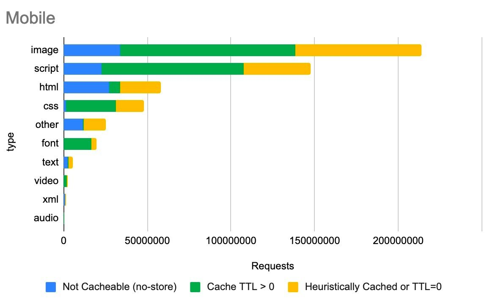


# Cache-Control vs Expires

In HTTP/1.0, the Expires header was used to indicate the date/time after which the response is considered stale. It’s value is an HTTP-date timestamp, such as:

 ` Expires: Thu, 01 Dec 1994 16:00:00 GMT`

HTTP/1.1 introduced the Cache-Control header, and most modern clients support both headers. This header provides much more extensibility via caching directives. For example:


*   no-store can be used to indicate that a resource should not be cached
*   max-age can be used to indicate a freshness lifetime
*   must-revalidate tells the client a cached entry must be validated with a conditional request prior to its use.
*   Private indicates a response should only be cached by a browser, and not by an intermediary that would serve multiple clients.

53% of HTTP responses include a Cache-Control header with the max-age directive, and 54% include the Expires header.  However, 41% of these responses use both headers, which means that 13% of responses are caching solely based on the Expires header. 

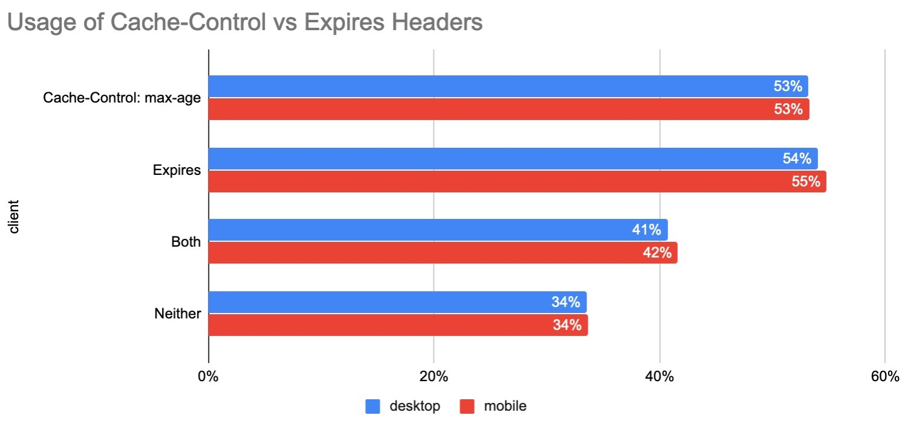


# Cache-Control Directives

The HTTP/1.1 [specification](https://tools.ietf.org/html/rfc7234#section-5.2.1) includes multiple directives that can be used in the Cache-Control response header and are detailed below. Note that multiple can be used in a single response.


<table>
  <tr>
   <td><em>Directive</em>
   <td>Description</td>
  </tr>
  <tr>
   <td>max-age</td>
   <td>Indicates the number of seconds that a resource can be cached for</td>
  </tr>
  <tr>
   <td>public</td>
   <td>Any cache may store the response.</td>
  </tr>
  <tr>
   <td>no-cache</td>
   <td>A cached entry must be revalidated prior to it's use</td>
  </tr>
  <tr>
   <td>must-revalidate</td>
   <td>A stale cached entry must be revalidated prior to its use</td>
  </tr>
  <tr>
   <td>no-store</td>
   <td>Indicates that a response is not cacheable</td>
  </tr>
  <tr>
   <td>private</td>
   <td>The response is intended for a specific user and should not be stored by shared caches.</td>
  </tr>
  <tr>
   <td>no-transform</td>
   <td>No transformations or conversions should be made to this resource</td>
  </tr>
  <tr>
   <td>proxy-revalidate</td>
   <td>Same as must-revalidate, but applies to shared caches.</td>
  </tr>
  <tr>
   <td>s-maxage</td>
   <td>Same as max age, but applies to shared caches only </td>
  </tr>
  <tr>
   <td>immutable</td>
   <td>Indicates that the cached entry will never change, and that revalidation is not necessary.</td>
  </tr>
  <tr>
   <td>stale-while-revalidate</td>
   <td>Indicates that the client is willing to accept a stale response while asynchronously checking in the background for a fresh one.</td>
  </tr>
  <tr>
   <td>stale-if-error</td>
   <td>Indicates that the client is willing to accept a stale response if the check for one fails.</td>
  </tr>
</table>


For example, the below header indicates that a cached entry should be stored for 43200 seconds and it can be stored by all caches. 


```
cache-control: public, max-age=43200
```


The graph below illustrates the top 15 Cache-Control directives in use. 

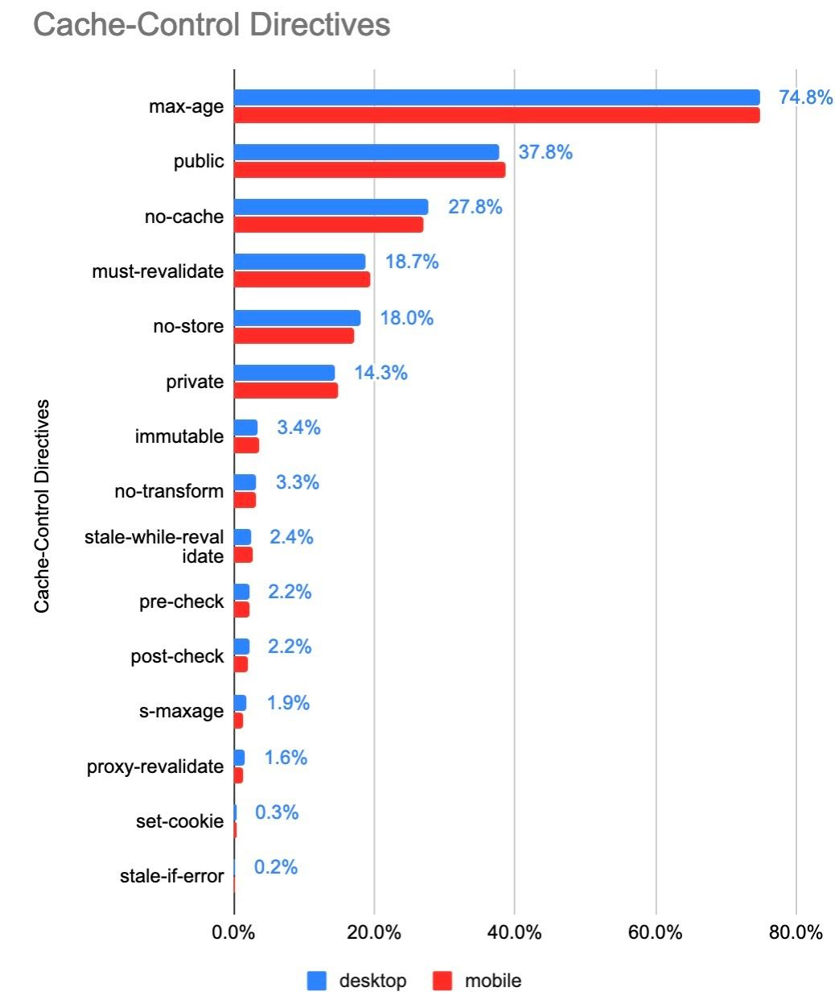

There are a few interesting observations about the popularity of these cache directives:

*   Max-age is used by almost 75% of Cache-Control headers, and no-store is used by 18%. 
*   Public is rarely necessary since cached entries are assumed public unless private is specified. Approximately 38% of responses include public.
*   The immutable directive is relatively new, [introduced in 2017](https://code.facebook.com/posts/557147474482256/this-browser-tweak-saved-60-of-requests-to-facebook) and is [supported on Firefox and Safari](https://developer.mozilla.org/en-US/docs/Web/HTTP/Headers/Cache-Control#Browser_compatibility). It’s usage has grown to 3.4%, and it is widely used in[ Facebook and Google third party responses](https://discuss.httparchive.org/t/cache-control-immutable-a-year-later/1195).

Another interesting set of directives to show up in this list are pre-check and post-check, which are used in 2.2% of Cache-Control response headers (approximately 7.8 million responses). This pair of headers was[ introduced in Internet Explorer 5 to provide a background validation](https://blogs.msdn.microsoft.com/ieinternals/2009/07/20/internet-explorers-cache-control-extensions/) and was rarely implemented correctly by websites. Based on the HTTP Archive, 99.2% of responses using these headers had used the combination of pre-check=0 and post-check=0. When both of these directives are set to 0, then both directives are ignored. So it seems these directives were never used correctly!  

In the long tail, there are more than 1500 erroneous directives in use across 0.28% of responses. These are ignored by clients, and include misspellings such as “nocache”, “s-max-age”, “smax-age”, and “maxage”. There are also numerous non-existent directives such as max-stale, proxy-public, surrogate-control, etc. 


# Cache-Control: no-store, no-cache and max-age=0

When a response is not cacheable, the Cache-Control no-store directive should be used.  If this directive is not used, then the response is cacheable.

There are a few common errors that are made when attempting to configure a response to be non-cacheable:


*   Setting Cache-Control: no-cache may sound like the resource will not be cacheable. However, the no-cache directive requires the cached entry to be revalidated prior to use,and is not the same as being non-cacheable.
*   Setting Cache-Control: max-age=0 sets the TTL to 0 seconds, but that is not the same as being non-cacheable. When max-age is set to 0, the resource is stored in the browser cache and immediately invalidated. This results in the browser having to perform a conditional request to validate the resource’s freshness.

Functionally no-cache and max-age=0 are similar, since they both require revalidation of a cached resource.  The no-cache directive can also be used alongside a max-age directive that is greater than 0.

Over 3 million responses include the combination of no-store, no-cache and max-age=0. Of these directives no-store takes precedence and the other directives are merely redundant

According to the HTTP Archive, 18% of responses include no-store, and 16.6% of responses include both no-store and no-cache. Since no-store takes precedence, the resource is ultimately non-cacheable. 

The max-age=0 directive is present on 1.1% of responses (> 4 million responses) where no-store is not present. These resources will be cached in the browser, but will require revalidation as they are immediately expired.


# How Do Cache TTLs Compare to Resource Age?

So far we’ve talked about how web servers tell a client what is cacheable, and how long it has been cached for. When designing cache rules, it’s also important to understand how old the content you are serving is. 

When you are selecting a cache TTL, ask yourself: “How often are you updating these assets?” and “what is their content sensitivity?”. For example, if a hero image is going to be modified infrequently - then cache it with a very long TTL. If you expect a JavaScript resource to change frequently, then version it and cache it with a long TTL or cache it with a shorter TTL.

The graph below illustrates the relative age of resources by content type, and you can read a [more detailed analysis here](https://discuss.httparchive.org/t/analyzing-resource-age-by-content-type/1659).  HTML tends to be the content type with the shortest age, and a very large % of traditionally cacheable resources scripts, css, and fonts) are older than 1 year!


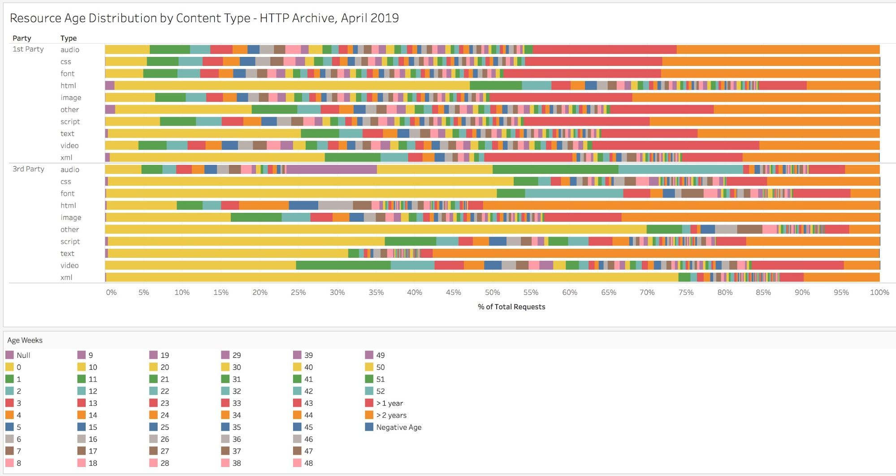


By comparing a resources cacheability to its age, we can determine if the TTL used is appropriate or too low. For example, the resource served by this response was last modified on 25 Aug 2019, which means that it was 49 days old at the time of delivery. The Cache-Control header says that we can cache it for 43,200 seconds, which is 12 hours. It is definitely old enough to merit investigating whether a longer TTL would be appropriate.


```
< HTTP/2 200
< date: Sun, 13 Oct 2019 19:36:57 GMT
< content-type: application/javascript; charset=utf-8
< content-length: 3052
< vary: Accept-Encoding
< server: gunicorn/19.7.1
< last-modified: Sun, 25 Aug 2019 16:00:30 GMT
< cache-control: public, max-age=43200
< expires: Mon, 14 Oct 2019 07:36:57 GMT
```


`< etag: "1566748830.0-3052-3932359948"` 

Overall, 59% of resources served on the web have a cache TTL that is too short compared to it’s content age. Furthermore, the median delta between the TTL and age is 25 days.

When we break this out by first vs third party, we can also see that 70% of first party resources can benefit from a longer TTL. This clearly highlights a need to spend extra attention focusing on what is cacheable, and then ensuring caching is configured correctly.


<table>
  <tr>
   <td></td>
   <td colspan="3" >% of Requests with Short TTLs</td>
  </tr>
  <tr>
   <td><em>client</em></td>
   <td>1st Party</td>
   <td>3rd Party</td>
   <td>Overall</td>
  </tr>
  <tr>
   <td>desktop</td>
   <td><p style="text-align: right">70.7%</p></td>
   <td><p style="text-align: right">47.9%</p></td>
   <td><p style="text-align: right">59.2%</p></td>
  </tr>
  <tr>
   <td>mobile</td>
   <td><p style="text-align: right">71.4%</p></td>
   <td><p style="text-align: right">46.8%</p></td>
   <td><p style="text-align: right">59.6%</p></td>
  </tr>
</table>


# Validating Freshness

The HTTP response headers used for validating the responses stored within a cache are Last-Modified and Etag. The Last-Modified header provides the time that the object was last modified, and the Etag header provides a unique identifier for the content. 

For example, the response below was last modified on 25 Aug 2019 and it has an Etag value of `"1566748830.0-3052-3932359948"`


```
< HTTP/2 200
< date: Sun, 13 Oct 2019 19:36:57 GMT
< content-type: application/javascript; charset=utf-8
< content-length: 3052
< vary: Accept-Encoding
< server: gunicorn/19.7.1
< last-modified: Sun, 25 Aug 2019 16:00:30 GMT
< cache-control: public, max-age=43200
< expires: Mon, 14 Oct 2019 07:36:57 GMT
< etag: "1566748830.0-3052-3932359948"
```


A client could send a conditional request to validate a cached entry by using the Last-Modified value in a request header named If-Modified-Since.  Similarly it could also validate the resource with an If-None-Match request header. 

In the example below, the cache entry is still valid and an HTTP 304 was returned with no content.  If the cache entry was no longer fresh, then the server would have responded with a 200 and the updated resource. 


```
> GET /static/js/main.js HTTP/2
> Host: www.httparchive.org
> User-Agent: curl/7.54.0
> Accept: */*
> If-Modified-Since: Sun, 25 Aug 2019 16:00:30 GMT

< HTTP/2 304
< date: Thu, 17 Oct 2019 02:31:08 GMT
< server: gunicorn/19.7.1
< cache-control: public, max-age=43200
< expires: Thu, 17 Oct 2019 14:31:08 GMT
< etag: "1566748830.0-3052-3932359948"
< accept-ranges: bytes
```


Overall, 65% of responses are served with a Last-Modified header, 42% are served with an Etag, and 38% use both.  However 30% of responses include neither a Last-Modified or Etag header.


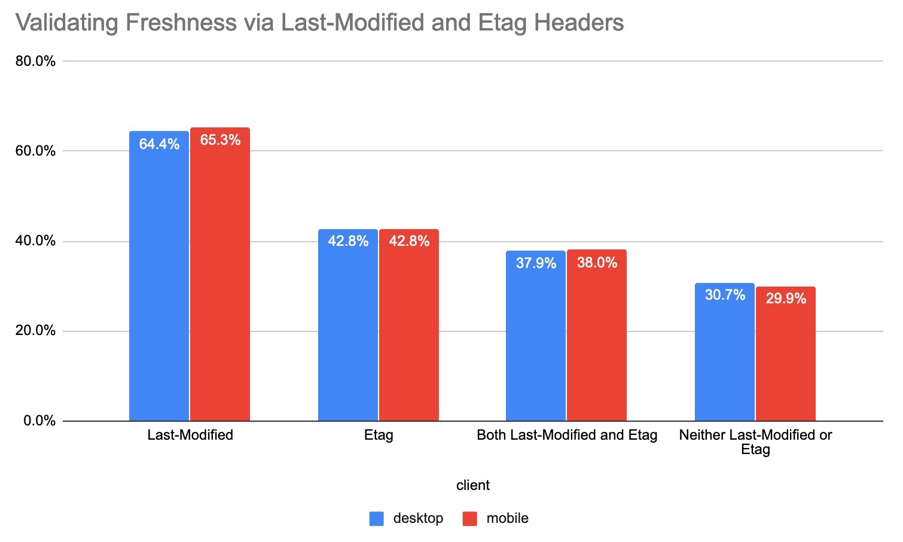


# Validity of Date Strings

There are a few HTTP headers used to convey timestamps, and the format for these are very important.  The Date response header indicates when the resource was served to a client. The Last-Modified response header indicates when a resource was last changed on the server. And the Expires header is used to indicate how long a resource is cacheable until (unless  a Cache-Control header is present). 

All 3 of these headers use an HTTP-date formatted string to represent timestamps.

For example:


```
> GET /static/js/main.js HTTP/2
> Host: httparchive.org
> User-Agent: curl/7.54.0
> Accept: */*
>

< HTTP/2 200
< date: Sun, 13 Oct 2019 19:36:57 GMT
< content-type: application/javascript; charset=utf-8
< content-length: 3052
< vary: Accept-Encoding
< server: gunicorn/19.7.1
< last-modified: Sun, 25 Aug 2019 16:00:30 GMT
< cache-control: public, max-age=43200
< expires: Mon, 14 Oct 2019 07:36:57 GMT
```


`< etag: "1566748830.0-3052-3932359948"` 

Most clients will ignore invalid date strings, which render them ineffective for the response they are served on. This can have consequences on cacheability, since an erroneous Last-Modified header will be cached without a Last-Modified timestamp resulting in the inability to perform a conditional request.

The Date HTTP response header is usually generated by the web server or CDN serving the response to a client. Because the header is generated server side, it tends to be less prone to error, which is reflected by the very low percentage of invalid Date headers. Last-Modified headers were very similar, with only 0.67% of them being invalid. What was very surprising to see though, was that 3.64% Expires headers used an invalid date format!

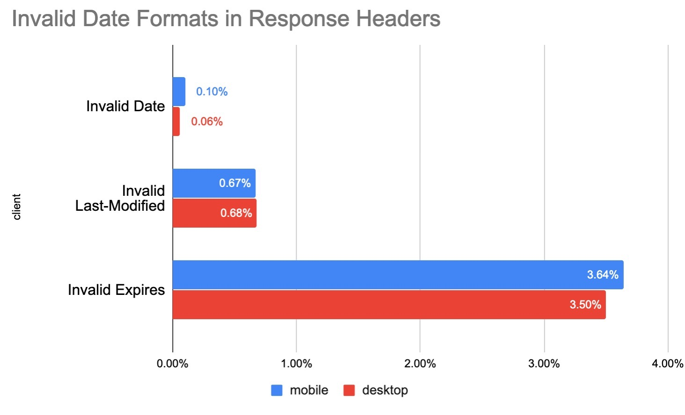


Examples of some of the invalid uses of the Expires header are:


*   Valid date formats, but using a timezone other than GMT
*   Numerical values such as 0 or -1
*   Values that would be valid in a Cache-Control header

The largest source of invalid Expires headers is from assets served from a popular third party, in which a date/time uses the EST timezone. 


```
Expires: Tue, 27 Apr 1971 19:44:06 EST
```


# Vary Header

One of the most important steps in caching is determining if the resource being requested is cached or not. While this may seem simple, many times the URL alone is not enough to determine this. For example, requests with the same URL could vary in what compression they used (gzip, brotli, ...) or be modified and tailored for mobile visitors.

To solve this problem, clients give each cached resource a unique identifier (a cache key). By default this cache key is simply the URL of the resource, but developers can add other elements (like compression method) by using the Vary header.

A Vary header instructs a client to add the value of one or more request header values to the cache key.  The most common example of this is` vary: Accept-Encoding, `which will result in different cached entries for Accept-Encoding request header values (ie, gzip, br, deflate). 

Another common value is `vary: Accept-Encoding, User-Agent, `which instructs the client to vary the cached entry by both the Accept-Encoding values and the User-Agent string.  When dealing with shared proxies and CDNs, using values other than Accept-Encoding can be problematic as it dilutes the cache keys and can reduce the amount of traffic served from cache.   

In general, you should only vary the cache if you are serving alternate content to clients based on that header.  

The Vary header is used on 39% of HTTP responses, and 45% of responses that include a Cache-Control header.   

The graph below details the popularity for the top 10 Vary header values. Accept-Encoding accounts for 90% of Vary’s use, with User-Agent (11%), Origin (??%), and Accept (??%) making up much of the rest.


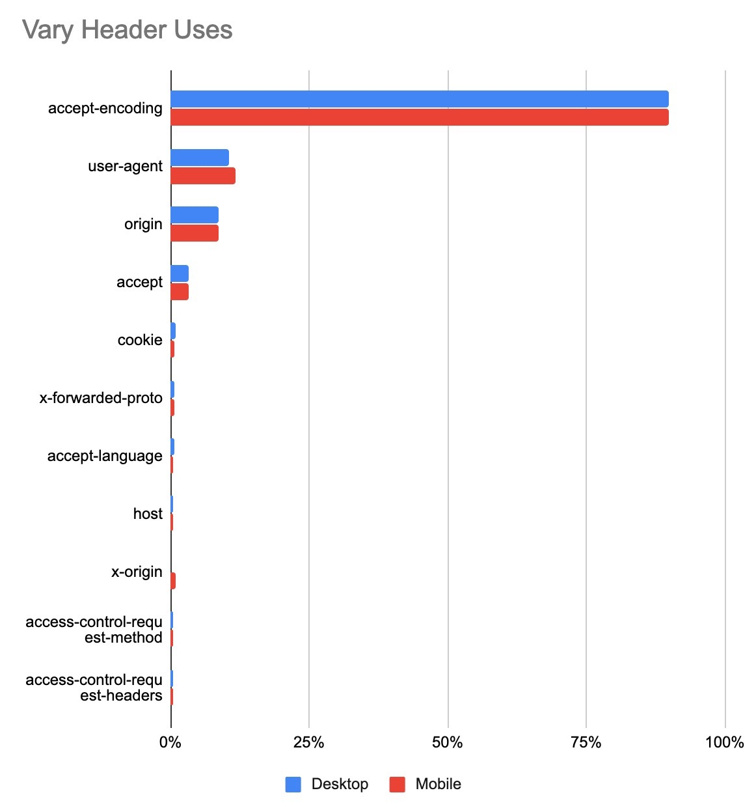


# Setting Cookies on Cacheable Responses

When a response is cached, it’s entire headers are swapped into the cache as well.  This is why you can see the response headers when inspecting a cached response via DevTools.


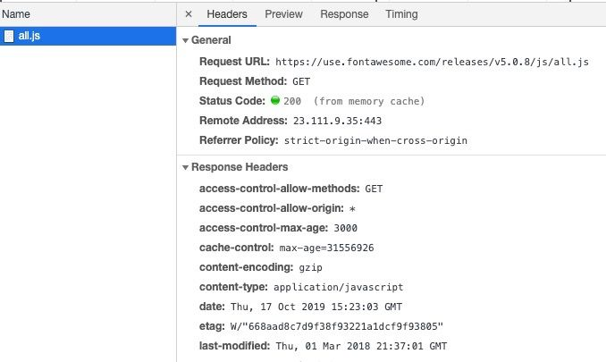

But what happens if you have a Set-Cookie on a response? According to [RFC 7234 Section 8](https://tools.ietf.org/html/rfc7234#section-8), the presence of a Set-Cookie response header does not inhibit caching. This means that a cached entry might contain a Set-Cookie if it was cached with one. The RFC goes on to recommend that you should configure appropriate Cache-Control headers to control how responses are cached. 

One of the risks of caching responses with Set-Cookie is that the cookie values can be stored and served to subsequent requests. Depending on the cookie’s purpose, this could have worrying results. For example, if a login cookie or a session cookie is present in a shared cache, then that cookie might be reused by another client. One way to avoid this is to use the Cache-Control “private” directive, which only permits the response to be cached by the client browser.

According to the HTTP Archive, 3% of cacheable responses contain a Set-Cookie header. Of those responses, only 18% use the private directive.  The remaining 82% include 5.3 million HTTP responses that include a Set-Cookie which can be cached by public and private cache servers. 


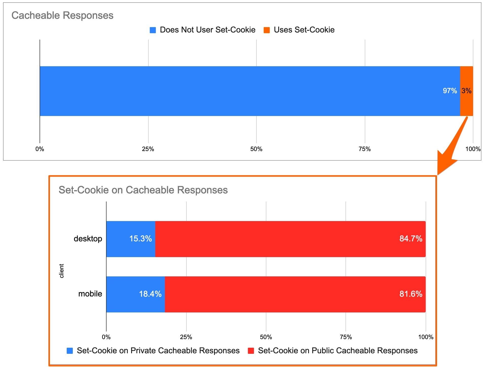


# AppCache and Service Workers

The Application Cache is a feature of HTML5 that allows developers to specify resources the browser should cache and make available to offline users. This feature was deprecated and removed from web standards, and browser support has been diminishing.  In fact when it’s use is detected, Firefox v44+ recommends that developers should use service workers instead.   Chrome 69+ restricts the Application Cache to secure context only. The industry has moved more towards implementing this type of functionality with Service Workers - and browser support has been rapidly growing for it.

In fact, one of the HTTP Archive trend reports shows the adoption of Service Workers. Adoption is still below 1% of websites, but it has been steadily increasing since January 2017.  


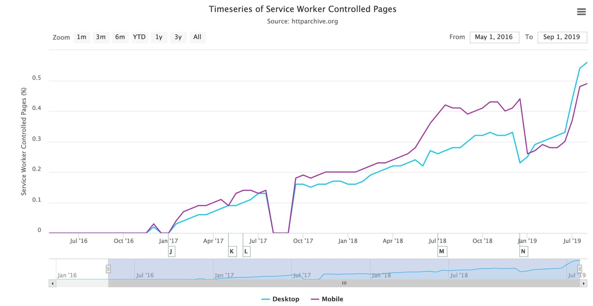


In the table below, you can see a summary of AppCache vs ServiceWorker usage.  32,292 websites have implemented a Service Worker, while 1,867 sites are still utilizing the deprecated AppCache feature.


<table>
  <tr>
   <td></td>
   <td>Does Not Use Server Worker</td>
   <td>Uses Service Worker</td>
   <td>Total</td>
  </tr>
  <tr>
   <td>Does Not Use AppCache</td>
   <td><p style="text-align: right">5,045,337</p></td>
   <td><p style="text-align: right">32,241</p></td>
   <td><p style="text-align: right">5,077,578</p></td>
  </tr>
  <tr>
   <td>Uses AppCache</td>
   <td><p style="text-align: right">1,816</p></td>
   <td><p style="text-align: right">51</p></td>
   <td><p style="text-align: right">1,867</p></td>
  </tr>
  <tr>
   <td>Total</td>
   <td><p style="text-align: right">5,047,153</p></td>
   <td><p style="text-align: right">32,292</p></td>
   <td><p style="text-align: right">5,079,445</p></td>
  </tr>
</table>


If we break this out by HTTP vs HTTPS, then this gets even more interesting.   581 of the AppCache enabled sites are served over HTTP, which means that Chrome is likely disabling the feature. HTTPS is a requirement for using Service Workers, but 907 of the sites using them are served over HTTP.


<table>
  <tr>
   <td></td>
   <td></td>
   <td>Does Not Use Service Worker</td>
   <td>Uses Service Worker</td>
  </tr>
  <tr>
   <td rowspan="2" >HTTP</td>
   <td>Does Not Use AppCache</td>
   <td><p style="text-align: right">1,968,736</p></td>
   <td><p style="text-align: right">907</p></td>
  </tr>
  <tr>
   <td>Uses AppCache</td>
   <td><p style="text-align: right">580</p></td>
   <td><p style="text-align: right">1</p></td>
  </tr>
  <tr>
   <td rowspan="2" >HTTPS</td>
   <td>Does Not Use AppCache</td>
   <td><p style="text-align: right">3,076,601</p></td>
   <td><p style="text-align: right">31,334</p></td>
  </tr>
  <tr>
   <td>Uses AppCache</td>
   <td><p style="text-align: right">1,236</p></td>
   <td><p style="text-align: right">50</p></td>
  </tr>
</table>


# Identifying Caching Opportunities

[Google’s Lighthouse](https://developers.google.com/web/tools/lighthouse) tool enables users to run a series of audits against web pages, and[ one of them](https://developers.google.com/web/tools/lighthouse/audits/text-compression) evaluates whether a site can benefit from additional caching. It does this by comparing the content age (via the Last-Modified header) to the Cache TTL and estimating the probability that the resource would be served from cache. Depending on the score, you may see a caching recommendation in the results, with a list of specific resources that could be cached.

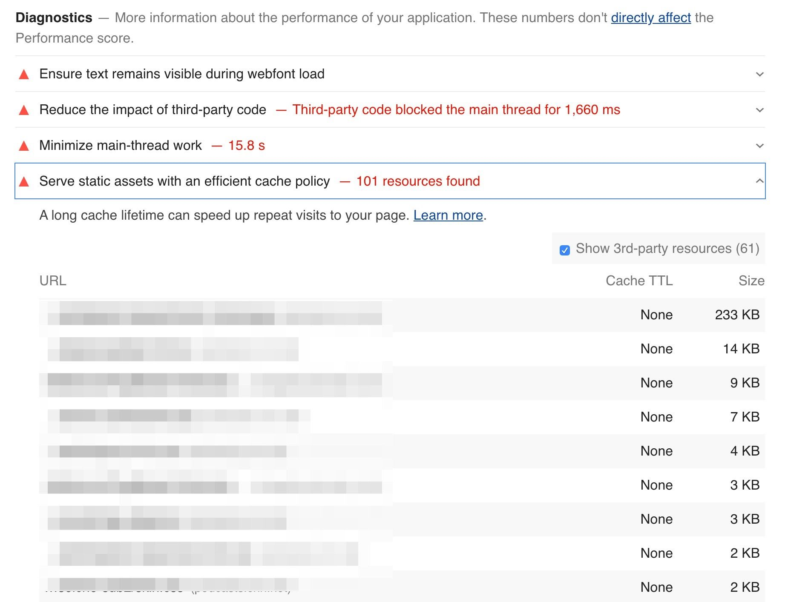


Lighthouse computes a score for each audit, ranging from 0% to 100%, and those scores are then factored into the overall scores. The [caching score](https://developers.google.com/web/tools/lighthouse/audits/cache-policy) is based on potential byte savings. When we examine the HTTP Archive Lighthouse data, we can get a perspective of how many sites are doing well with their cache policies. Only 3.4% of sites scored a 100%, meaning that most sites can benefit from some cache optimizations. A vast majority of sites sore below 40%, with 38% scoring less than 10%. Based on this, there is a significant amount of caching opportunities on the web. 

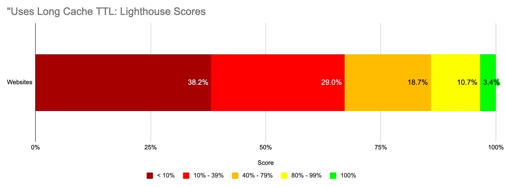


Lighthouse also indicates how many bytes could be saved on repeat views by enabling a longer cache policy. Of the sites that could benefit from additional caching, 82% of them can reduce their page weight by up to 1 MB!

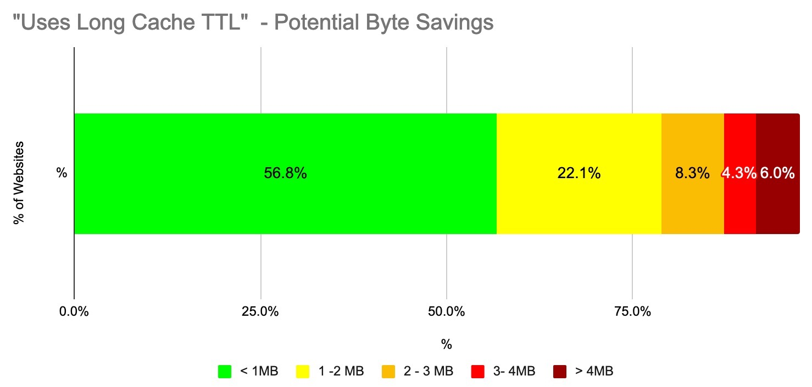

# Conclusion

Caching is an incredibly powerful feature that allows browsers, proxies and other intermediaries (such as CDNs) to store web content and serve it to end users. The performance benefits of this are significant, since it reduces round trip times and minimizes costly network requests.

Caching is also a very complex topic. There are numerous HTTP response headers that can convey freshness as well as validate cached entries, and Cache-Control directives provide a tremendous amount of flexibility and control. However developers should be cautious about the additional opportunities for mistakes that it comes with. Regularly auditing your site to ensure that cacheable resources are cached appropriately is recommended, and tools like Lighthouse and REDbot do an excellent job of helping to simplify the analysis.


