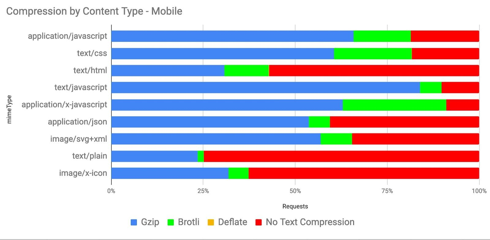

# Intro

HTTP Compression is a technique that allows you to encode information using fewer bits than the original representation. When used for delivering web content, it enables web servers to reduce the amount of data transmitted to clients. This increases the efficiency of the client’s bandwidth, reduces page weight and improves web performance.

Compression algorithms are often categorized as Lossy or Lossless: 

*   When a lossy compression algorithm is used, the process is irreversible and the original file can not be restored via decompression. This is commonly used to compress media resources - such as image and video content. 
*   Lossless compression is a completely reversible process, and is commonly used to compress text based resources - such as HTML, JavaScript, Stylesheets, etc. 

In this chapter, we are going to explore how text based content is compressed on the web.


# How HTTP Compression Works

When a client makes an HTTP request, it often includes an [Accept-Encoding](https://developer.mozilla.org/en-US/docs/Web/HTTP/Headers/Accept-Encoding) header to advertise the compression algorithms it is capable of decoding. The server can then select from one of the advertised encodings it supports, and serve a compressed response. The compressed response would include a [Content-Encoding](https://developer.mozilla.org/en-US/docs/Web/HTTP/Headers/Content-Encoding) header so that the client is aware of which compression was used. Additionally, a [Content-Type](https://developer.mozilla.org/en-US/docs/Web/HTTP/Headers/Content-Type) header is often used to indicate the mime type of the resource being served. 

In the example below, the client advertised support for Gzip, Brotli and Deflate compression. The server decided to return a gzip compressed response containing a text/html document.


```
    > GET / HTTP/2
    > Host: httparchive.org
    > Accept-Encoding: gzip, deflate, br

    < HTTP/2 200  
    < content-type: text/html; charset=utf-8
    < content-encoding: gzip
```


The HTTP Archive contains measurements for 5.3 million web sites, and each site loaded at least 1 compressed text resource on their home page. Additionally, resources were compressed on the primary domain on 81% of web sites.


# Compression Algorithms

IANA maintains a [list of valid HTTP Content Encodings](https://www.iana.org/assignments/http-parameters/http-parameters.xml#content-coding) that can be used with the Accept-Encoding and Content-Encoding headers. These include gzip, deflate, br (brotli), as well as a few others. A brief description of these algorithms are:

*   [Gzip](https://tools.ietf.org/html/rfc1952) uses the LZ77 and Huffmman coding compression techniques, and is older than the web itself. It was originally developed for the UNIX gzip program in 1992. An implementation for web delivery has existed since HTTP/1.1, and most web browsers and clients support it.
*   [Deflate](https://en.wikipedia.org/wiki/DEFLATE) uses the same algorithm as gzip, just with a different container. It’s use was not widely adopted for the web because of [compatibility issues](https://en.wikipedia.org/wiki/HTTP_compression#Problems_preventing_the_use_of_HTTP_compression) with some servers and browsers.
*   [Brotli](https://github.com/google/brotli) compression is a newer compression algorithm that was invented by Google. It uses the combination of a modern variant of the LZ77 algorithm, Huffman coding and 2nd order context modeling. Compression via brotli is more computationally expensive compared to gzip, but the algorithm is able to reduce files by 15-25% more than gzip compression. Brotli was first used for compressing web content in 2015, and is[ supported by all modern web browsers](https://caniuse.com/#search=brotli).

Appoximately 38% of HTTP responses are delivered with text based compression. This may seem like a surprising statistic, but keep in mind that it is based on all HTTP requests in the archive. Some content, such as images, will not benefit from these compression algorithms. The table below summarizes the percentage of requests served with each content encoding.

<table>
  <tr>
   <td></td>
   <td colspan="2" >% of Requests</td>
   <td colspan="2" >Requests</td>
  </tr>
  <tr>
   <td><em>Content Encoding</em></td>
   <td>desktop</td>
   <td>mobile</td>
   <td>desktop</td>
   <td>mobile</td>
  </tr>
  <tr>
   <td>none</td>
   <td><p style="text-align: right">62.87%</p></td>
   <td><p style="text-align: right">61.47%</p></td>
   <td><p style="text-align: right">260245106</p></td>
   <td><p style="text-align: right">285158644</p></td>
  </tr>
  <tr>
   <td>gzip</td>
   <td><p style="text-align: right">29.66%</p></td>
   <td><p style="text-align: right">30.95%</p></td>
   <td><p style="text-align: right">122789094</p></td>
   <td><p style="text-align: right">143549122</p></td>
  </tr>
  <tr>
   <td>br
   </td>
   <td><p style="text-align: right">7.43%</p></td>
   <td><p style="text-align: right">7.55%</p></td>
   <td><p style="text-align: right">30750681</p></td>
   <td><p style="text-align: right">35012368</p></td>
  </tr>
  <tr>
   <td>deflate</td>
   <td><p style="text-align: right">0.02%</p></td>
   <td><p style="text-align: right">0.02%</p></td>
   <td><p style="text-align: right">68802</p></td>
   <td><p style="text-align: right">70679</p></td>
  </tr>
  <tr>
   <td>Other / Invalid</td>
   <td><p style="text-align: right">0.02%</p></td>
   <td><p style="text-align: right">0.01%</p></td>
   <td><p style="text-align: right">67527</p></td>
   <td><p style="text-align: right">68352</p></td>
  </tr>
  <tr>
   <td>identity</td>
   <td><p style="text-align: right">0.000709%</p></td>
   <td><p style="text-align: right">0.000563%</p></td>
   <td><p style="text-align: right">2935</p></td>
   <td><p style="text-align: right">2611</p></td>
  </tr>
  <tr>
   <td>x-gzip</td>
   <td><p style="text-align: right">0.000193%</p></td>
   <td><p style="text-align: right">0.000179%</p></td>
   <td><p style="text-align: right">800</p></td>
   <td><p style="text-align: right">829</p></td>
  </tr>
  <tr>
   <td>compress</td>
   <td><p style="text-align: right">0.000008%</p></td>
   <td><p style="text-align: right">0.000007%</p></td>
   <td><p style="text-align: right">33</p></td>
   <td><p style="text-align: right">32</p></td>
  </tr>
  <tr>
   <td>x-compress</td>
   <td><p style="text-align: right">0.000002%</p></td>
   <td><p style="text-align: right">0.000006%</p></td>
   <td><p style="text-align: right">8</p></td>
   <td><p style="text-align: right">29</p></td>
  </tr>
</table>

Of the resources that are served compressed, the majority are using either either gzip (80%) or brotli (20%). The other compression algorithms are infrequently used.


Additionally, there are 67K requests that return an invalid Content-Encoding, such as “none”, “UTF-8”, “base64”, “text”, etc. These resources are likely served uncompressed.

We can’t determine the compression levels from any of the diagnostics collected by the HTTP Archive, but the best practice for compressing content will be:

*   At a minimum, enable gzip compression level 6 for text based assets. This provides a fair tradeoff between computational cost and compression ratio and is the [default for many web servers](https://paulcalvano.com/index.php/2018/07/25/brotli-compression-how-much-will-it-reduce-your-content/).
*   If you can support brotli and precompress resources, then compress to brotli level 11.  This is more computationally expensive than gzip - so precompression is an absolute must to avoid delays. 
*   If you can support brotli and are unable to precompress, then compress to brotli level 5. This level will result in smaller payloads compared to gzip, with a similar computational overhead.


# What Type of Content Are We Compressing

Most text based resources (such as HTML, CSS and JavaScript) can benefit from gzip and brotli compression. However, it’s often not necessary to use these compression techniques on binary resources, such as images, video and some web fonts because their file formats are already compressed.

In the graph below, the top 25 content types are displayed with box sizes representing the relative amount of requests. The color of each box represents how many of these resources were served compressed. Most of the media content is shaded red, which is expected since gzip and brotli would have little to no benefit for them.  Most of the text content is shaded green to indicate that they are being compressed. However, the light green shading for some content types indicate that they are not compressed as consistently as the others. 


Filtering out the 6 most popular content types allows us to see the rest of these content types more clearly.The application/json and image/svg+xml content types are compressed less than 65% of the time.   

Most of the custom web fonts are served without compression, since they are already in a compressed format. However font/ttf is compressible, but only 84% of TTF font requests are being served with compression.


The graphs below illustrates the breakdown of compression techniques used for each content type. Looking at the top 3 content types, we can see that across both Desktop and Mobile there are major gaps in compressing some of the most frequently requested content types. 56% of text/html as well as 18% of application/javascript and text/css resources are not being compressed. This presents a significant performance opportunity.. 


The content types with the lowest compression rates include application/json, text/xml and text/plain. These resources are commonly used for XHR requests to provide data that web applications can use to create rich experiences. Compressing them will likely improve user experience.  Vector graphics such as image/svg+xml, and image/x-icon are not often thought of as text based, but they are and sites that use them would benefit from compression. 




Across all content types, gzip is the most popular compression algorithm. Brotli compression is used less frequently, and the content types where it appears most are application/javascript, text/css and application/x-javascript. This is likely due to to CDNs that automatically apply brotli compression for traffic that passes through them. 

# 1st Party vs 3rd Party Compression

In Chapter 5, we learned about third parties and their impact on performance. When we compare compression techniques between first and third parties, we can see that third party content tends to be compressed more than first party content. 

Additionally, the percentage of Brotli compression is higher for third party content. This is likely due to the number of resources served from third parties that support Brotli, such as Google and Facebook with Brotli.

<table>
  <tr>
   <td><em>Content Encoding</em></td>
   <td>FirstParty</td>
   <td>ThirdParty</td>
   <td>FirstParty</td>
   <td>ThirdParty</td>
  </tr>
  <tr>
   <td>No Text Compression</td>
   <td><p style="text-align: right">66.23%</p></td>
   <td><p style="text-align: right">59.28%</p></td>
   <td><p style="text-align: right">64.54%</p></td>
   <td><p style="text-align: right">58.26%</p></td>
  </tr>
  <tr>
   <td>gzip</td>
   <td><p style="text-align: right">29.33%</p></td>
   <td><p style="text-align: right">30.20%</p></td>
   <td><p style="text-align: right">30.87%</p></td>
   <td><p style="text-align: right">31.22%</p></td>
  </tr>
  <tr>
   <td>br</td>
   <td><p style="text-align: right">4.41%</p></td>
   <td><p style="text-align: right">10.49%</p></td>
   <td><p style="text-align: right">4.56%</p></td>
   <td><p style="text-align: right">10.49%</p></td>
  </tr>
  <tr>
   <td>deflate</td>
   <td><p style="text-align: right">0.02%</p></td>
   <td><p style="text-align: right">0.01%</p></td>
   <td><p style="text-align: right">0.02%</p></td>
   <td><p style="text-align: right">0.01%</p></td>
  </tr>
  <tr>
   <td>other / invalid
   </td>
   <td><p style="text-align: right">0.01%</p></td>
   <td><p style="text-align: right">0.02%</p></td>
   <td><p style="text-align: right">0.01%</p></td>
   <td><p style="text-align: right">0.02%</p></td>
  </tr>
</table>

# Identifying Compression Opportunities

[Google’s Lighthouse](https://developers.google.com/web/tools/lighthouse) tool enables users to run a series of audits against web pages, and[ one of them](https://developers.google.com/web/tools/lighthouse/audits/text-compression) evaluates whether a site can benefit from additional text based compression. It does this by attempting to compress resources and evaluate whether an object’s size can be reduced by at least 10% and 1400 bytes. Depending on the score, you may see a compression recommendation in the results, with a list of specific resources that could be compressed.


Because the HTTP Archive runs Lighthouse audits for each mobile page, we can aggregate the scores across all sites to learn how much opportunity there is to compress more content. Overall, 62% of websites are passing this audit and almost 23% of websites have scored below a 40. This means that over 1.2 million websites could benefit from enabling additional text based compression.


Lighthouse also indicates how many bytes could be saved by enabling text compression. Of the sites that could benefit from text compression, 82% of them can reduce their page weight by up to 1 MB!


# Conclusion

HTTP Compression is a widely used and highly valuable feature for reducing the size of web content. Both gzip and brotli compression are the dominant algorithms used, and the amount of compressed content varies by content type. Tools like Google Lighthouse can help uncover opportunities to compress content. 

At a minimum, websites should use gzip compression for all text based resources, since it is widely supported, easily implemented and has a low processing overhead. Additional savings can be found with brotli compression, although compression levels should be chosen carefully based on whether a resource can be precompressed.

